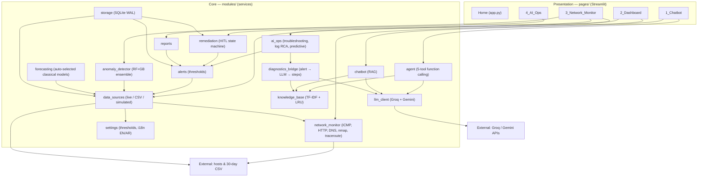
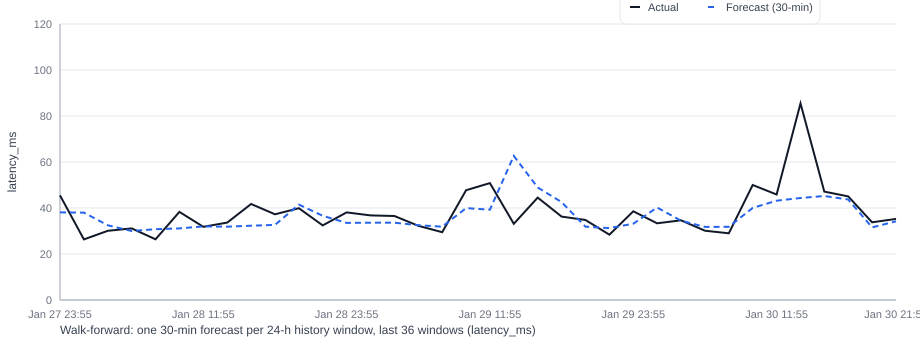

# AI Smart Bot for Network Management System

> **Graduation Project** — An AI-powered NOC assistant that monitors infrastructure in real time, detects anomalies with machine learning, forecasts capacity, and diagnoses faults in plain language via LLM APIs (Groq + Gemini).

**Live Demo:** [ai-smart-bot-for-network-management.streamlit.app](https://ai-smart-bot-for-network-management.streamlit.app) · **Repository:** [@Mshabrawy-m](https://github.com/Mshabrawy-m/AI-Smart-Bot-for-Network-Management)

---

## Badges

[](https://www.python.org/)
[](https://streamlit.io/)
[](https://scikit-learn.org/)
[](https://groq.com)
[](https://ai.google.dev/)
[](https://ai-smart-bot-for-network-management.streamlit.app)
[](https://github.com/Mshabrawy-m/AI-Smart-Bot-for-Network-Management)
[](https://github.com/Mshabrawy-m/AI-Smart-Bot-for-Network-Management/commits)

---

## Table of Contents

- [Overview](#overview)
- [Why This Project](#why-this-project)
- [Features](#features)
- [Architecture](#architecture)
  - [Alert → Explanation flow](#alert--explanation-flow)
  - [Agent chatbot flow](#agent-chatbot-flow)
- [Tech Stack](#tech-stack)
- [Project Structure](#project-structure)
- [Quick Start](#quick-start)
- [Configuration (API keys & secrets)](#configuration-api-keys--secrets)
- [Usage Guide](#usage-guide)
- [Machine Learning](#machine-learning)
  - [Anomaly Detection](#anomaly-detection)
  - [Forecasting](#forecasting)
  - [Knowledge Base / RAG](#knowledge-base--rag)
- [Results](#results)
  - [Classification (anomaly detection)](#classification-anomaly-detection)
- [Time Series Results](#time-series-results)
- [Diagnostics & Remediation](#diagnostics--remediation)
- [Evaluation & Logging](#evaluation--logging)
- [Testing](#testing)
- [Development Scripts](#development-scripts)
- [Deploy to Streamlit Community Cloud](#deploy-to-streamlit-community-cloud)
- [Roadmap](#roadmap)
- [Limitations](#limitations)
- [Troubleshooting](#troubleshooting)
- [Contributing](#contributing)
- [References](#references)
- [Acknowledgments](#acknowledgments)
- [License](#license)

---

## Overview

**AI Smart Bot for Network Management** is a single-dashboard, LLM-first network operations center (NOC) assistant. It unifies:

- **Real-time monitoring** — ICMP, HTTP, DNS, port scanning, and traceroute
- **ML anomaly detection** — a Random Forest + Gradient Boosting ensemble
- **Capacity forecasting** — validation-driven auto-selection over persistence, rolling, EMA, linear, and daily-seasonal candidates
- **Retrieval-augmented chatbot** — grounded networking Q&A
- **Agent mode** — an LLM that calls live tools to answer with real data, then explains alerts and proposes remediation

It runs locally with `streamlit run app.py` (Python 3.12) or deploys to **Streamlit Community Cloud** with nothing more than an API key pair.

---

## Why This Project

Most student NOC dashboards stop at charts. This one closes the loop: it *explains* what an alert means in plain language, cites the relevant networking concept from its own knowledge base, and hands the operator vendor-ready commands — while keeping a human in the loop for anything that actually touches the network. The graduation goal was to demonstrate that LLM tool-calling, classical ML, and a monitoring stack can work together as one coherent product rather than three separate demos.

---

## Features

| # | Feature | What it does |
|---|---------|--------------|
| 1 | **AI Chatbot** | Two modes — RAG-only (fast, KB-grounded) and **Agent** (function-calling over live data). Ask networking questions or paste diagnostics for step-by-step interpretation. |
| 2 | **NOC Dashboard** | Device KPIs, threshold alerts with AI explanations, 24h traffic forecasting, incident management with approval workflows. |
| 3 | **Network Monitor** | Live ICMP ping, HTTP health checks, DNS lookups, TCP port scanning with security assessment, batch monitoring, traceroute, multi-host analysis dashboard. |
| 4 | **AI Ops Suite** | ML anomaly detection (RF+GB ensemble), log root-cause analysis, capacity forecasting, human-in-the-loop remediation, AI-generated reports. |
| 5 | **Diagnostics Bridge** | On alert, sends the fault to the LLM and returns a plain-language explanation with numbered, vendor-ready troubleshooting steps (Cisco / MikroTik). |

---

## Architecture



### Alert → Explanation flow

1. `data_sources.py` collects device telemetry (live ping + `psutil`, 30-day CSV, or simulated data).
2. `alerts.py` evaluates thresholds → `critical` / `warning` / `ok` alert objects.
3. User clicks **Explain** on an alert.
4. `diagnostics_bridge.py` retrieves relevant KB context → builds a structured prompt → calls the LLM.
5. A plain-language explanation (likely cause + numbered steps + Cisco/MikroTik commands) is displayed inline.
6. The event (retrieval score, latency, provider) is persisted to `network_bot.db`.

### Agent chatbot flow

1. User query → `agent.py` calls Groq with 5 tool definitions (OpenAI-format function calling).
2. The model decides which tools to invoke (max `MAX_TOOL_ITERATIONS = 4`):
   - `search_knowledge_base` — TF-IDF search over 40 networking entries
   - `check_device_status` — live device metrics
   - `run_ping` — real ICMP probe
   - `get_recent_alerts` — current threshold alerts
   - `get_anomaly_score` — RF+GB ensemble prediction
3. Tool results are fed back as context → the model produces a final answer, rendered with a collapsible tool trace.

---

## Tech Stack

| Category | Technology |
|----------|------------|
| **Framework** | Python 3.12 · Streamlit ≥1.32 |
| **LLM (primary)** | Groq API (`openai/gpt-oss-120b`) via `groq` SDK |
| **LLM (fallback)** | Google Gemini (`gemini-2.0-flash`) via `google-generativeai` |
| **ML — Anomaly** | scikit-learn · RandomForest + GradientBoosting ensemble (300 trees each) with auto-labeling |
| **ML — Forecast** | validation-driven auto-selection (persistence / rolling / EMA / linear / daily-seasonal) |
| **ML — RAG** | TF-IDF vectorization + cosine similarity over a local JSON knowledge base |
| **Charts** | Plotly (`graph_objects`) — bar, line, radar, dual-axis with threshold overlays |
| **Network** | `ping3` (ICMP) · `socket` (TCP fallback, DNS) · `requests` (HTTP) · `psutil` (host metrics) · `python-nmap` (port scan) |
| **Storage** | SQLite (WAL mode) — chat history, alerts, incidents, evaluation metrics |
| **i18n** | English + Arabic (RTL) via `modules/settings.py` |
| **Runtime** | `runtime.txt` pins `python-3.12` (`.streamlit/config.toml` enforces a dark NOC theme) |

---

## Project Structure

```
AI Smart Bot for Network Management System
├── app.py                          # Home page, sidebar, theme, navigation
├── requirements.txt                # Python dependencies
├── runtime.txt                     # python-3.12
├── README.md
├── .gitignore
├── .streamlit/
│   ├── config.toml                 # Dark NOC theme + i18n config
│   ├── secrets.toml                # API keys (GIT-IGNORED — never commit)
│   └── secrets.toml.example        # Template — safe to commit
├── data/
│   ├── knowledge_base.json         # 40 networking Q&A entries for RAG
│   └── real_network_traffic.csv    # 8,640 rows, 5-min intervals (30 days)
├── modules/                        # Core application modules
│   ├── __init__.py                 # Python 3.14 import-compat shim
│   ├── ai_ops.py                   # Operational AI: troubleshooting plans, log RCA, predictive signals
│   ├── alerts.py                   # Threshold-based alert engine
│   ├── anomaly_detector.py         # RF+GB ensemble with auto-labeling
│   ├── chatbot.py                  # RAG orchestration: retrieve → prompt → LLM
│   ├── agent.py                    # Agentic chatbot with 5-tool function-calling
│   ├── data_sources.py             # Live / real-CSV / simulated data adapters
│   ├── diagnostics_bridge.py       # Alert → KB context → LLM explanation
│   ├── forecasting.py              # Auto-selected classical forecasting (+ optional LSTM)
│   ├── knowledge_base.py           # TF-IDF search engine with LRU cache
│   ├── llm_client.py               # Groq / Gemini wrapper with fallback
│   ├── network_monitor.py          # ICMP, HTTP, DNS, port scanner, traceroute
│   ├── remediation.py              # Human-in-the-loop incident state machine
│   ├── reports.py                  # AI-generated health & incident reports
│   ├── settings.py                 # Thresholds, i18n (EN + AR), provider config
│   ├── storage.py                  # SQLite persistence (chat, alerts, incidents, eval)
│   └── ui.py                       # Global CSS injection (NOC dark theme, RTL)
├── pages/                          # Streamlit multi-page app
│   ├── 1_Chatbot.py                # RAG mode + Agent tool-calling mode
│   ├── 2_Dashboard.py              # Device KPIs, alerts, charts, forecast, incidents
│   ├── 3_Network_Monitor.py        # Ping, HTTP, DNS, port scan, batch, traceroute, analysis
│   └── 4_AI_Ops.py                 # Fault diagnosis, anomaly ML, log analysis, remediation
├── tests/
│   └── test_ai_workflows.py        # Unit tests for core AI workflows
└── dev/                            # Development & benchmark scripts
    ├── bench_deep.py               # Deep-learning model comparison
    ├── bench_forecast.py           # Walk-forward forecast method comparison
    ├── bench_models.py             # Anomaly-detection model benchmark
    ├── eval_accuracy.py            # Full accuracy evaluation (anomaly + forecast)
    ├── feature_performance.py      # Knowledge-base & alert performance tests
    ├── run_sanity_checks.py        # Core-module smoke tests
    └── tune_threshold.py           # Decision-threshold calibration
```

> `network_bot.db`, `tmp_perf_test.db`, and `.streamlit/secrets.toml` are **auto-created at runtime** and are git-ignored.

---

## Quick Start

### Prerequisites

- **Python 3.12** — required (Python 3.14 has import-compatibility issues, see `modules/__init__.py`)
- **Groq API key** (free) — [console.groq.com](https://console.groq.com)
- *(Optional)* **Gemini API key** — [aistudio.google.com](https://aistudio.google.com), used as automatic fallback

### Install & Run

```bash
git clone https://github.com/Mshabrawy-m/AI-Smart-Bot-for-Network-Management.git
cd AI-Smart-Bot-for-Network-Management

python -m venv .venv
.venv\Scripts\activate        # Windows
# source .venv/bin/activate   # Linux / macOS

pip install -r requirements.txt

cp .streamlit/secrets.toml.example .streamlit/secrets.toml
# Edit .streamlit/secrets.toml with your API keys

streamlit run app.py
```

Open [http://localhost:8501](http://localhost:8501).

---

## Configuration (API keys & secrets)

```toml
# .streamlit/secrets.toml
GROQ_API_KEY = "gsk_your_key_here"
GEMINI_API_KEY = "your_gemini_key_here"   # optional fallback
LLM_PROVIDER = "groq"                     # "groq" (primary) or "gemini"

# Optional: comma-separated hosts/IPs to monitor in Live mode.
# Defaults to public probes (Google DNS, Cloudflare, etc.)
# MONITORED_HOSTS = "192.168.1.1, 8.8.8.8, 1.1.1.1"
```

> **Never commit `secrets.toml`.** It is listed in `.gitignore`.

---

## Usage Guide

| Page | Purpose |
|------|---------|
| **Home** | Welcome, quick-start, system status snapshot, recent incidents. |
| **Chatbot** | Ask networking questions. Toggle **RAG mode** (fast, KB-grounded) or **Agent mode** (live tool calling). |
| **Dashboard** | Device KPIs, alert feed, ML-anomaly scores, 24h forecast, incident lifecycle. |
| **Network Monitor** | Run ping / HTTP / DNS / port-scan / traceroute on single or multiple hosts; view a multi-host analysis table. |
| **AI Ops** | Fault diagnosis, anomaly detection scores, log root-cause analysis, capacity trends, and remediation with approval gates. |

---

## Machine Learning

### Anomaly Detection (`modules/anomaly_detector.py`)

- **Algorithm:** Supervised ensemble — RandomForest (300 trees) + GradientBoosting (300 trees) with soft voting
- **Auto-labeling:** Domain rules generate training labels without manual annotation:
  - Contextual spikes (> k × rolling std)
  - Global IQR outlier gates
  - Sudden change detection
  - Hard thresholds per metric (packet_loss > 3%, latency > 150 ms, CPU > 90%)
- **Features:** Rolling mean / std / z-score (24-period window), rate-of-change, time features (hour, day_of_week, business_hour, peak_hour)
- **Decision:** Score threshold 0.65 with a Z-score safety gate (4.0σ) for extreme outliers
- **Output:** Anomaly score (0–1) + per-feature contributions

### Forecasting (`modules/forecasting.py`)

A validation-driven forecaster: a family of cheap classical candidates
(persistence, rolling averages, EMA, linear trend, daily-seasonal averages) is
scored on a held-out recent tail of the history at the exact forecast horizon,
and the best model — or a small blend of the top two — produces the prediction.
This replaced the previous variance-heuristic single-method forecaster.

- **Methods:** `auto` (recommended) plus explicit `persistence`, `rolling`,
  `ema`, `linear`, `exponential` (Holt-Winters damped trend, explicit only),
  `seasonal_hour`, `seasonal_naive`, and `lstm` (Keras, trained in an isolated
  subprocess — opt-in, `use_deep_learning=True`).
- **Output:** predicted value + method metadata. The
  Dashboard warns when a forecast crosses a capacity threshold within the
  30-minute horizon.

### Knowledge Base / RAG (`modules/knowledge_base.py`)

- **Content:** 40 networking entries covering OSI model, TCP/IP, DNS, DHCP, VLAN, routing, switching, firewalls, VPN, SNMP, BGP, OSPF, load balancing, and more
- **Indexing:** TF-IDF vectorization over `topic + keywords + answer`
- **Retrieval:** Cosine similarity with an LRU cache (128 entries)

---

## Results

All numbers come from the evaluation harness in `dev/eval_accuracy.py`, run against `data/real_network_traffic.csv` (8,640 rows, 5-minute intervals).

### Classification (anomaly detection)

Time-aware RF + GB ensemble, 80/20 split (6,287 normal / 625 annotated anomalies in training, 29 engineered features). Ground truth uses the same domain rules used for auto-labeling; metrics are computed on the held-out 20% test set.

| Metric | Value |
|---|---|
| Precision | 0.993 |
| Recall | 0.993 |
| F1 Score | 0.993 |
| False Positive Rate | 0.0006 |
| True positives | 146 |
| False negatives | 1 |
| False alarms | 1 |
| Test anomalies detected | 147 / 1,728 (8.5%) |

> Synthetic-injection sensitivity (rate 3–20% at severity 2–10×) is also reported by the harness in `dev/eval_accuracy.py`.

---

## Time Series Results

All numbers come from the evaluation harness in `dev/eval_accuracy.py` plus the
per-method sweep in `dev/bench_forecast.py`, both run against
`data/real_network_traffic.csv` (8,640 rows, 5-minute intervals). Protocol:
354 walk-forward windows, one forecast per window at a 30-minute horizon, method
re-selected per window.



### Walk-forward evaluation (`auto` selector)

| Metric | MAE | MAPE | RMSE | Method selected |
|---|---|---|---|---|
| bandwidth_mbps | 19.95 | 32.9% | 38.16 | Same-hour-of-day average |
| latency_ms | 8.03 | 19.5% | 19.93 | Exponential moving average |
| packet_loss_pct | 0.084 | N/A* | 0.31 | Rolling (24) + rolling (10) blend |

\* MAPE is undefined for near-zero packet-loss values; MAE is the reliable metric there.

### Model comparison (walk-forward MAE)

| Method | bandwidth_mbps | latency_ms | packet_loss_pct |
|---|---|---|---|
| **auto** (per-window selection) | 19.95 | **8.03** | 0.084 |
| seasonal_hour (same-hour-of-day average) | **19.82** | 8.10 | 0.087 |
| rolling | 20.03 | 8.20 | 0.089 |
| EMA | 20.22 | 8.35 | 0.077 |
| persistence | 23.67 | 10.71 | **0.071** |
| linear | 25.58 | 10.07 | 0.136 |

The `auto` selector never commits to a single method: it scores every candidate
on a held-out tail at the target horizon and blends the top two when they are
within 5% (see `modules/forecasting.py`). It is best or near-best on every row —
matching the seasonal average on bandwidth (19.95 vs 19.82), beating all single
methods on latency, and on packet_loss trading slightly higher MAE (0.084 vs
0.071) for a far better RMSE (0.310 vs 0.475, i.e. fewer large misses).
Rolling-family models win ~71% of windows and seasonal (same-hour-of-day)
averages ~28%, so the selector adapts per window instead of assuming one model
fits all metrics.

> **LSTM:** an optional Keras LSTM (trained in an isolated subprocess,
> `use_deep_learning=True`) is available but requires TensorFlow/Keras, which
> are not in the default runtime; it never beat the classical candidates on
> these series, so it stays opt-in.

---

## Diagnostics & Remediation

Operated from the **AI Ops** page, combining three modules:

- **`diagnostics_bridge.py`** — on an alert, retrieves KB context, calls the LLM, and returns a cause + numbered, vendor-ready steps
- **`ai_ops.py`** — builds structured troubleshooting plans (`build_troubleshooting_plan`), performs keyword-based log root-cause analysis (`analyze_logs`), generates predictive risk signals (`build_predictive_signal`), and assembles plain-text incident reports (`build_incident_report`)
- **`remediation.py`** — a human-in-the-loop incident state machine: **create → diagnose → suggest → approve/reject**, with every action persisted to `network_bot.db`

---

## Evaluation & Logging

Every chatbot query and alert explanation is persisted to `network_bot.db` with:

- Retrieval score (TF-IDF cosine similarity of the top KB hit)
- Retrieval hit/miss flag
- End-to-end latency (ms)
- Provider + temperature

This enables reporting retrieval hit-rate and answer latency from real interactions during the graduation demo. See `modules/storage.py`.

---

## Testing

```bash
pip install pytest          # if not already installed
pytest tests/test_ai_workflows.py -v
```

Tests cover: anomaly-detection outlier accuracy, alert explanation with a mocked LLM, operational-summary generation, predictive-signal building, incident-report structure, the full remediation lifecycle (create → diagnose → suggest → approve), and report fallback when the LLM call fails.

---

## Development Scripts

| Script | Purpose |
|--------|---------|
| `dev/eval_accuracy.py` | Full accuracy evaluation — anomaly classification + walk-forward forecasting metrics |
| `dev/bench_models.py` | Anomaly-detection model comparison (RF / GB / Isolation Forest baselines) |
| `dev/bench_forecast.py` | Walk-forward forecast method comparison (persistence / rolling / EMA / linear / seasonal vs `auto`) |
| `dev/bench_deep.py` | Deep-learning baseline benchmarking |
| `dev/tune_threshold.py` | Calibrate the 0.65 decision threshold / Z-score gate |
| `dev/feature_performance.py` | Knowledge-base retrieval hit-rate and alert latency |
| `dev/run_sanity_checks.py` | Fast smoke tests for core modules |

---

## Deploy to Streamlit Community Cloud

1. Push this repo to GitHub with `app.py` at the root.
2. Go to [share.streamlit.io](https://share.streamlit.io) → **New app** → select your repo → `app.py`.
3. In **Settings → Advanced**, set **Python version to 3.12** (Cloud ignores `runtime.txt`).
4. In **Settings → Secrets**, add your API keys (same format as `secrets.toml`).
5. Click **Deploy**. Every push redeploys automatically.

### Deployment limitations

Streamlit Cloud **cannot reach private LAN addresses** (`192.168.x.x`, `10.x.x.x`). Live mode probes public hosts (Google DNS, Cloudflare) but not internal routers. For real LAN monitoring, deploy on-premises or via a VPN. **Simulated mode** works identically everywhere.

---

## Roadmap

Ideas for continuing this project past the graduation milestone:

- [ ] Wire `pysnmp` into the stubbed SNMP extension point for real polling
- [ ] Replace TF-IDF retrieval with an embedding-based vector store for semantic search
- [ ] Add authentication and per-user role scoping for the remediation approval workflow
- [ ] Support additional vendors beyond Cisco/MikroTik in the diagnostics bridge
- [ ] Package the anomaly detector as a swappable model (add LSTM / Isolation Forest as alternatives)
- [ ] Add a local/self-hosted LLM option for offline or air-gapped deployments

---

## Limitations

| Constraint | Detail |
|-----------|--------|
| **No local LLM** | Hosted APIs only (Groq/Gemini). Requires internet + API key. |
| **API rate limits** | Free tiers have daily/RPM quotas. Swap providers via `LLM_PROVIDER` in secrets. |
| **Session state** | Resets on restart. Only SQLite-persisted data (incidents, eval metrics) survives. |
| **SNMP stubbed** | Extension point only. Wire to `pysnmp` for production use. |
| **Agent latency** | 2–5s per tool call, up to 4 iterations per query. |
| **ICMP privileges** | Raw sockets may require admin. Falls back to TCP probing (ports 443/80). |
| **TF-IDF vs embeddings** | Fast and free but misses semantic similarity. Upgrade path: embedding vector store. |
| **Python 3.14** | Has import-machinery incompatibilities on Streamlit Cloud. Use Python 3.12. |

---

## Troubleshooting

| Problem | Fix |
|---------|-----|
| `GROQ_API_KEY is not set` | Add `GROQ_API_KEY` to `.streamlit/secrets.toml` (copy from `secrets.toml.example`). |
| Live ping shows all hosts down | Raw ICMP needs admin; the app falls back to TCP probes on ports 443/80. |
| App fails to start | Confirm `python --version` is 3.12; reinstall with `python -m venv .venv && pip install -r requirements.txt`. |
| Anomaly detector "not initialized" | It auto-trains on the first device query from 24h of history — wait one cycle or check the CSV loads. |

---

## Contributing

This started as a graduation project, but issues and pull requests are welcome:

1. Fork the repo and create a feature branch (`git checkout -b feature/your-idea`)
2. Run `pytest tests/test_ai_workflows.py -v` before opening a PR
3. Keep new modules consistent with the existing pattern: one responsibility per file under `modules/`, with a matching page under `pages/` if it needs a UI
4. Open a PR describing the change and, where relevant, before/after screenshots

---

## References

### Large Language Models & AI Agents

| # | Reference |
|---|----------|
| [1] | Groq Inc. — *GroqCloud LPU Inference Engine*. [https://groq.com](https://groq.com) |
| [2] | Google DeepMind — *Gemini: A Family of Highly Capable Multimodal Models*, 2024. [arxiv.org/abs/2312.11805](https://arxiv.org/abs/2312.11805) |
| [3] | Liu, C., Xie, X., Zhang, X., & Cui, Y. — *Large Language Models for Networking: Workflow, Advances and Challenges*, 2024. [arxiv.org/abs/2404.12901](https://arxiv.org/abs/2404.12901) |
| [4] | OpenAI — *Function Calling with Chat Completions API*. [platform.openai.com/docs/guides/function-calling](https://platform.openai.com/docs/guides/function-calling) |
| [5] | Wei, J. et al. — *Chain-of-Thought Prompting Elicits Reasoning in Large Language Models*, NeurIPS 2022. [arxiv.org/abs/2201.11903](https://arxiv.org/abs/2201.11903) |
| [6] | Yao, S. et al. — *ReAct: Synergizing Reasoning and Acting in Language Models*, ICLR 2023. [arxiv.org/abs/2210.03629](https://arxiv.org/abs/2210.03629) |
| [7] | Schick, T. et al. — *Toolformer: Language Models Can Teach Themselves to Use Tools*, NeurIPS 2023. [arxiv.org/abs/2302.04761](https://arxiv.org/abs/2302.04761) |

### Retrieval-Augmented Generation (RAG)

| # | Reference |
|---|----------|
| [8] | Lewis, P. et al. — *Retrieval-Augmented Generation for Knowledge-Intensive NLP Tasks*, NeurIPS 2020. [arxiv.org/abs/2005.11401](https://arxiv.org/abs/2005.11401) |
| [9] | Gao, Y. et al. — *Retrieval-Augmented Generation for Large Language Models: A Survey*, 2024. [arxiv.org/abs/2312.10997](https://arxiv.org/abs/2312.10997) |
| [10] | Salton, G. & Buckley, C. — *Term-Weighting Approaches in Automatic Text Retrieval*, Information Processing & Management, 1988. [doi.org/10.1016/0306-4573(88)90021-0](https://doi.org/10.1016/0306-4573(88)90021-0) |
| [11] | Manning, C. et al. — *Introduction to Information Retrieval*, Cambridge University Press, 2008. [nlp.stanford.edu/IR-book](https://nlp.stanford.edu/IR-book/) |

### Machine Learning — Anomaly Detection

| # | Reference |
|---|----------|
| [12] | Breiman, L. — *Random Forests*, Machine Learning 45(1), 2001. [doi.org/10.1023/A:1010933404324](https://doi.org/10.1023/A:1010933404324) |
| [13] | Friedman, J. H. — *Greedy Function Approximation: A Gradient Boosting Machine*, Annals of Statistics, 2001. [doi.org/10.1214/aos/1013203451](https://doi.org/10.1214/aos/1013203451) |
| [14] | Bharathi, I. & Makhija, R. — *Network Intrusion Detection System using Random Forest and Gradient Boosting Machines*, 2024. [doi.org/10.1109/CONIT61985.2024.10627542](https://doi.org/10.1109/CONIT61985.2024.10627542) |
| [15] | Chandola, V. et al. — *Anomaly Detection: A Survey*, ACM Computing Surveys 41(3), 2009. [doi.org/10.1145/1541880.1541882](https://doi.org/10.1145/1541880.1541882) |
| [16] | Pedregosa, F. et al. — *Scikit-learn: Machine Learning in Python*, JMLR 12, 2011. [jmlr.org/papers/v12/pedregosa11a.html](https://jmlr.org/papers/v12/pedregosa11a.html) |
| [17] | Dietterich, T. G. — *Ensemble Methods in Machine Learning*, MCS 2000. [doi.org/10.1007/3-540-45014-9_1](https://doi.org/10.1007/3-540-45014-9_1) |

### Time Series Forecasting

| # | Reference |
|---|----------|
| [18] | Hyndman, R. J. & Athanasopoulos, G. — *Forecasting: Principles and Practice*, 3rd ed., OTexts, 2021. [otexts.com/fpp3](https://otexts.com/fpp3/) |
| [19] | Holt, C. C. — *Forecasting Seasonals and Trends by Exponentially Weighted Moving Averages*, International Journal of Forecasting, 2004. [doi.org/10.1016/j.ijforecast.2003.09.015](https://doi.org/10.1016/j.ijforecast.2003.09.015) |
| [20] | Winters, P. R. — *Forecasting Sales by Exponentially Weighted Moving Averages*, Management Science, 1960. [doi.org/10.1287/mnsc.6.3.324](https://doi.org/10.1287/mnsc.6.3.324) |
| [21] | Hyndman, R. J., Koehler, A. B., Ord, J. K., & Snyder, R. D. — *Forecasting with Exponential Smoothing: The State Space Approach*, Springer Series in Statistics, 2008. [doi.org/10.1007/978-3-540-71918-2](https://doi.org/10.1007/978-3-540-71918-2) |

### Network Management & Monitoring

| # | Reference |
|---|----------|
| [22] | Stallings, W. — *Data and Computer Communications*, 10th ed., Pearson, 2014. |
| [23] | Kurose, J. F. & Ross, K. W. — *Computer Networking: A Top-Down Approach*, 8th ed., Pearson, 2021. [gaia.cs.umass.edu/kurose_ross](https://gaia.cs.umass.edu/kurose_ross/) |
| [24] | RFC 792 — *Internet Control Message Protocol (ICMP)*. [rfc-editor.org/rfc/rfc792](https://www.rfc-editor.org/rfc/rfc792) |
| [25] | RFC 3411–3418 — *SNMPv3 Architecture*. [rfc-editor.org/rfc/rfc3411](https://www.rfc-editor.org/rfc/rfc3411) |
| [26] | Cisco — *Network Management Best Practices*. [cisco.com/c/en/us/support/docs/network-management](https://www.cisco.com) |
| [27] | Subramanian, M. — *Network Management: Principles and Practice*, 2nd ed., Pearson, 2010. |

### Frameworks & Libraries

| # | Reference |
|---|----------|
| [28] | Streamlit Inc. — *Streamlit Documentation*. [docs.streamlit.io](https://docs.streamlit.io) |
| [29] | Plotly Technologies Inc. — *Plotly Python Graphing Library*. [plotly.com/python](https://plotly.com/python/) |
| [30] | Giannakakis, G. — *psutil: A Cross-Platform Library for System and Process Utilities*. [github.com/giampaolo/psutil](https://github.com/giampaolo/psutil) |
| [31] | SQLite Consortium — *SQLite: The Database Engine*. [sqlite.org](https://www.sqlite.org) |
| [32] | Streamlit Community Cloud — *Deploy Streamlit Apps*. [share.streamlit.io](https://share.streamlit.io) |

### AIOps & Intelligent IT Operations

| # | Reference |
|---|----------|
| [33] | Gartner — *Market Guide for AIOps Platforms*, 2022. [gartner.com/en/documents/4016379](https://www.gartner.com/en/documents/4016379) |
| [34] | Bhattacharjee, A. et al. — *AIOps: Intelligent IT Operations for Cloud and Network Management*, IEEE, 2022. [doi.org/10.1109/ACCESS.2022.3187250](https://doi.org/10.1109/ACCESS.2022.3187250) |
| [35] | Dang, Y. et al. — *AI in Operations Management: Applications and Challenges*, Production and Operations Management, 2022. [doi.org/10.1111/poms.13676](https://doi.org/10.1111/poms.13676) |

### Information Retrieval (Lexical Models)

| # | Reference |
|---|----------|
| [36] | Robertson, S. E. & Zaragoza, H. — *The Probabilistic Relevance Framework: BM25 and Beyond*, Foundations and Trends® in Information Retrieval, 2009. [doi.org/10.1561/1500000019](https://doi.org/10.1561/1500000019) |

### AI-Driven Log Analysis & Human-in-the-Loop Remediation

| # | Reference |
|---|----------|
| [37] | Liu, Y., Tao, S., Meng, W., Wang, J., Ma, W., Zhao, Y., Chen, Y., Yang, H., Jiang, Y., & Chen, X. — *Interpretable Online Log Analysis Using Large Language Models with Prompt Strategies (LogPrompt)*, Proc. ICPC 2024, 2023. [arxiv.org/abs/2308.07610](https://arxiv.org/abs/2308.07610) |
| [38] | Wittkopp, T., Wiesner, P., & Kao, O. — *LogRCA: Log-based Root Cause Analysis for Distributed Services*, Euro-Par 2024, 2024. [arxiv.org/abs/2405.13599](https://arxiv.org/abs/2405.13599) |
| [39] | Mukherjee, S. — *AI-Driven Autonomous IT Operations: A Human-in-the-Loop AIOps 2.0 Framework*, Int. J. Intell. Syst. Appl. Eng., 12(23s), 4317–4325, 2024. [doi.org/10.17762/ijisae.v12i23s.8304](https://doi.org/10.17762/ijisae.v12i23s.8304) |

### Project Reference

| # | Reference |
|---|----------|
| [40] | *AI Smart Bot for Network Management System* (graduation project, 2026). GitHub. [github.com/Mshabrawy-m/AI-Smart-Bot-for-Network-Management](https://github.com/Mshabrawy-m/AI-Smart-Bot-for-Network-Management) |

---

## Acknowledgments

Built as a graduation project combining coursework in networking, machine learning, and applied LLM engineering. Thanks to the maintainers of the open-source libraries listed in [Tech Stack](#tech-stack), whose work made a single-developer NOC assistant feasible in a semester timeline.

---

## License

Graduation project — adjust attribution and license terms as required by your institution.
